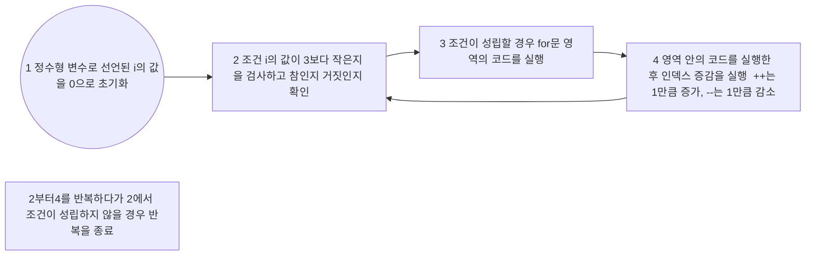
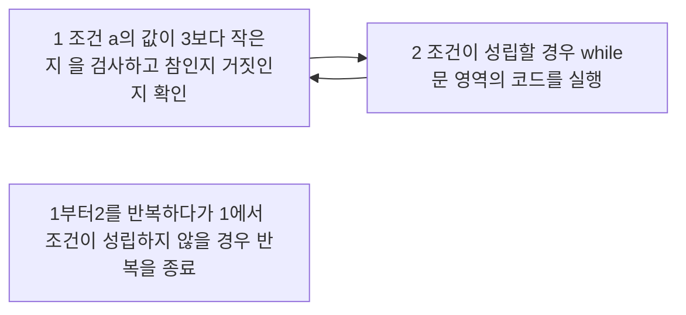

# for문
>**for(인덱스 초기화; 반복 조건; 인덱스 증감)**
> - **초기화, 조건, 증감에 대한 부분을 세미콜론(;)으로 구분**
> - **if문과 동일하게 실행할 코드가 한 줄이면 중괄호 생략 가능** 

```cpp
int i, a = 10;      //정수형 변수 i와a를 선언하고, a를 10으로 초기화
for(i=0;i<3;i++){   //인덱스 변수 i를 0으로 초기화하고, i<3이라는 조건이 참이라면
	a=a+1;          //a의 값을 1만큼 증가
	printf("%d",a);
}
```
|i값|i<3 조건 참/거짓 여부|코드 실행 과정|
|--|--|--|
|0|참|a값 1만큼 증가→11 출력→i값 1만큼 증가|
|1|참|a값 1만큼 증가→12 출력→i값 1만큼 증가|
|2|참|a값 1만큼 증가→13 출력→i값 1만큼 증가|
|1|거짓|반복 종료(for문 탈출)|


# while문
>**for와 다르게 while은 조건만 지정하여 반복을 수행할 수 있음**
```cpp
int a = 1;    //정수형 변수 a를 선언하고, a를 1으로 초기화
while(a<3){   //a<3이라는 조건이 참이라면 while문 영역의 코드 실행
	a=a+1;    //a의 값을 1만큼 증가
	printf("%d",a);
}
```
|a값|a<3 조건 참/거짓 여부|코드 실행 과정|
|--|--|--|
|1|참|a값 1만큼 증가 → 2 출력|
|2|참|a값 1만큼 증가 → 3 출력|
|3|거짓|반복 종료(while문 탈출)|

